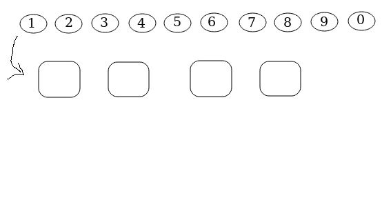

# Lecture 1

2020-03-16

## Kap 2

Utfall, utfallsrum, händelser.

Resultatet av ett slumpmässigt försök kallas för ett utfall $\omega$.

Mängden av alla möjliga utfall bildar utfallsrummet $\Omega$.

Händelse (e.g. "jämn siffra").

En händelse ($A, B, C, A_1, A_2, A_3$, etc) är en samling utfall, d.v.s. en delmängd av $\Omega$.

Sannolikheten att $A$ inträffar $P(A)$. $0 <= P(A) <= 1$. $P(\Omega) = 1$ (sannolikheten att ett utfall hamnar i utfallsrummet $\Omega$ är $100%$).

**Diskret utfallsrum** har vi om antalet utfall är ändligt eller uppräkneligt oändligt.

*ex.* Antal kast på en tärning vi måste göra för att få samma resultat 2 gånger.

$\Omega = {2, 3, 4, 5, 6, 7}$

Vid 7 kast så måste vi fått minst samma resultat (punkter på en tärning) minst en gång.

*ex.* Antal kast vi måste göra för att få samma resultat 2 gånger i rad.

$\Omega = {2, 3, 4, 5, ...}$ (oänderligt $\Omega$, diskret utfallsrum då det är uppräkneligt oändligt).

**Kontinuerligt utfallsrum** har vi om antalet utfall vare sig är ändlight eller uppräkneligt oändligt.

*ex.* Anta att $x$ är antalet minuter tills klockan slår hel timme. (oänderlig decimalutveckling).

$\Omega = [0, 60]$

Utfallen är oändligt många och ligger oändligt tätt.

## Mängdlära

Snitt, union, komplement.

### Venndiagram

**Snitt**

$A_1 \intersect A_2 \intersect A_3$

$P(A_1 \intersect A_2 \intersect A_3) = P(alla händelser inträffar)$

**Union**

$A_1 \union A_2 \union A_3$

$P(A_1 \union A_2 \union A_3) = P(minst en av händelserna inträffar)$

**Komplement**

Komplementet till $A$ skrivs $A*$ = icke $A$.

$P(A) + P(A*) = 1$

**Disjunkta händelser** är händelser som ej kan inträffa samtidigt.

*def:* Två händelser är disjunkta <=> $P(A \intersect B) = 0$

$P(A \union B \union C) = P(A) + P(B) + P(C) - P(A \intersect B) - P(A \intersect C) - P(B \intersect C) + P(A \intersect B \intersect C)$

**Unionsformeln**

$P(A \union B) = P(A) + P(B) - P(A \intersect B)$

Om händelserna är disjunkta.

$P(A \union B \union C) = P(A) + P(B) + P(C)$

$P(A \union B \union C) = P(minst en av A, B eller C inträffar) = 1 - P(A* \intersect B* \intersect C*)$

d.v.s. $P(A \union B \union C) = 1 - P(A* \intersect B* \intersect *)$

d.v.s. $P(A \union B \union C)* = A* \intersect B* \intersect C*$

## Kombinatorik

Antag att alla utfall är lika sannolika. Då gäller den klassiska sannolikhetsdefinitionen.

Händelse $H$.

$P(H) = \frac{antal gynsamma utfall}{antal möjliga utfall} = \frac{g}{m}$

**Multiplikationsprincipen**

*ex:* Meny med 2 förrätter, 4 varmrätter och 3 desserter.

Hur många måltider kan vi komponera?

Totalt: $2*4*3 = 24$

### Dragning med återläggning med hänsyn till ordning

Hur många PIN-koder finns det med 4 siffror?

På hur många sätt kan vi välja fyra siffror från 10?

Totalt antal sätt att dra 4 element från 10 = $10^4$.

Antalet sätt att dra $k$ element från $n$ = $n^k$.

### Dragning utan återläggning med hänsyn till ordning

*ex:* Vi är en förening med 8 medlemmar och ska välja ordförande, sekreterare och kassör.

Ordföranden kan väljas på 8 sätt.
Sekreteraren kan väljas på 7 sätt.
Kassören kan väljas på 6 sätt.

=> Antalet kombinationer = $8*7*6$.

D.v.s. antalet sätt att dra 3 element från 8 är

$$ 8*7*6 = \frac{8*7*6*5*4*3*2*1}{5*4*3*2*1} = \frac{8!}{(8-3)!} $$

Antalet sätt att dra $k$ element från $n = \frac{n!}{(n-k)!}$

*calc:* på miniräknaren är $\frac{8!}{(8-3)!}$ = `8P3`

### Dragning utan återgivning utan hänsyn till ordning

*ex:* Hur många pokergivar finns det?

D.v.s hur många sätt finns det att dra 5 kort från 52?

Vi börjar med att ta hänsyn till ordning och får då antalet kombinationer till $52*51*50*49*48$.

Om jag permuterar korten har jag fortfarande samma pokergiv.

Det första kortet kan väljas (placeras) på 5 ställen i handen, det andra på 4 sätt, etc.

=> Varje pokergiv utan hänsyn till ordning kan generera $5*4*3*2*1$ med hänsyn till ordning.

Således blir antalet pokergiv utan hänsyn till ordning = $\frac{52*51*50*49*48}{5*4*3*2*1}$.

D.v.s. för varje utfall utan hänsyn till ordning med ...

$$
    \frac{52*51*50*49*48*...*3*2*1}{47*46*45*...*3*2*1 * 5*4*3*2*1} =
    \frac{52!}{(52-5)! * 5!} =
    \frac{n!}{(n-k)! * k!} =
$$

$(n choose k) = \frac{n!}{(n-k)! * k!}$

Binomialkoefficienter: $(n över k) = (n choose k) = \frac{n!}{k!(n-k)!}$.

Antal sätt att dra $5$ element från $52$ är (52 över 5).
Antal sätt att dra $k$ element från $n$ är (n över k).

*calc*: på miniräknaren `nCk` (choose)
