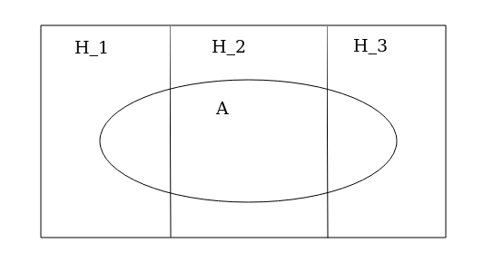

# Lecture 2

2020-03-17

## Kombinatorik repetition

1) Dragning **med** återläggning **med** hänsyn till ordning.

*ex:* Hur många pinkoder finns det med 4 siffror?

Det är antal sätt att dra 4 siffror från 10 = $10^4$.

*allmännt:* Antal sätt att dra $k$ element från $n$ = $n^k$.

2) Dragning **utan** återläggning **med** hänsyn till ordning.

*ex:*En klubb med 8 medlemmar väljer ordförande, sekreterare, kassörska.

Antal kombinationer blir här $8*7*6 = \frac{8*7*6*5!}{5!} = \frac{8!}{(8-3)!}$.

*allmänt*: Antal sätt att dra $k$ element från $n$ = $\frac{n!}{(n-k)!}$

3) Dragning **utan** återläggning **utan** hänsyn till ordning.

Antal pokerhänder = antal sätt att dra 5 kort från 52.

"52 över 5" = "52 välj 5" = "52 choose 5".

$(52 choose 5) = \frac{52!}{(52-5)!5!}$

Antal sätt att dra $k$ element från $n$.

$(n choose k) = \frac{n!}{(n-k)!k!}$

$0! = 1$ per definition.

*ex:* Anta att vi har en burk med 20 svarta och 30 vita kulor.

Vi drar 10 kulor utan återläggning.

P("6 svarta") = P("6 svarta och 4 vita").

Klassiska sannolikhetsdefinitions = $\frac{gynnsamma utfall}{antal möjliga utfall}$.

Ett utfall är en kombination av 10 kulor.

Från början (S_1) (S_2) ... (S_20) (V_1) (V_2) ... (V_30)

Hur många möjliga utfall finns det?

Det är antal sätt att dra 10 kulor från $(20+30) = 50$.

$m = (50 choose 10)$

Antal gynnsamma fall blir antal sätt att dra 6 svarta från 20 samtidigt som vi drar 4 vita från 30.

$g = (20 choose 6)*(30 choose 4)$

$P("6 svarta") = P("6 svarta och 4 vita") = \frac{g}{m} = \frac{(20 choose 6)*(30 choose 4)*}{(50 choose 10)}$

jämför sid 24 i Blom.

Hypergeometrisk fördelning.

P(k vita) = \frac{(v choose k)(s choose n-k)}{(v+s choose n)}

## Betingning

$P(A | B)$ läses sannolikheten för av betingat B.

Inledande exempel (Blom sid 26).

+---------+--------+-------------+
|         | Rökare | Icke rökare |
+---------+--------+-------------+
| Männ    | 20     | 80          |
| Kvinnor | 50     | 100         |
+---------+--------+-------------+

A="man" B="rökare"

$P(A) = \frac{g}{m} = \frac{100}{250}$
$P(B) = \frac{g}{m} = \frac{70}{250}$

$P(A \intersect B) = \frac{20}{250}$

$P(A | B) = \frac{20}{100} = \frac{\frac{20}{250}}{\frac{100}{250}} = \frac{P(A \intersect B)}{P(A)}$

Betingningsformeln:
$P(A | B) = P(A \intersect B)P(A)$


## Lagen om total sannolikhet

*ex:* (2.17 i Blom)

H_1 = enheten kommer från maskin 1. Analogt för H_2, H_3.

A = "enheten är defekt"

Givet:

P(H_1) = 0.25
P(H_2) = 0.35
P(H_3) = 0.40

P(A | H_1) = 0.05
P(A | H_2) = 0.04
P(A | H_3) = 0.02



Sökt: P(A) = P(A \intersect H_1) + P(A \intersect H_2) + P(A \intersect H_3)

$P(A | H_1) = \frac{P(A \intersect H_1)}{P(H_1)}$

$P(A) = P(A | H_1)*P(H_1) + P(A | H_2)*P(H_2) + P(A | H_3)*P(H_3)$
Detta är lagen om total sannolikhet.

$P(A) = 0.05*0.25 + 0.04*0.35 + 0.02*0.40 = 0.0345$


P(defekt) = tre vägar =

$0.25*0.05 + 0.35*0.04 + 0.40*0.02 = 0.0345$

## Bayes sats

*ex:* (2.19 i Blom) Som är en fortsättning på ex 2.17.

En kund påträffar en defekt enhet. Vad är sannolikheten att den kommer från maskin 1.

Sökt $P(H_1 | A)$

$$
    P(H_1 | A) = \frac{P(H_1 \intersect A)}{P(A)}

      P(A | H_1) * P(H_1)
    = _________________________________________________________
      P(A | H_1)*P(H_1) + P(A | H_2)*P(H_2) + P(A | H_3)*P(H_3)

      P(A | H_1) * P(H_1)
    = _________________________________
      \sum_{i=1}^{3}{P(A | H_i)*P(H_i)}

      0.05 * 0.25                         0.0125
    = _________________________________ = ______ = 36.23%
      0.05*0.25 + 0.04*0.35 + 0.02*0.40   0.0345
$$

Detta kallas Bayes sats.

                       "gynsam väg"
Jämför trädstrukturen: _____________
                       möjliga vägar

*ex:* (2.20 i Blom)

H_1 = "person har sjukdomen"
A = "testet ger positivt utslag"

Givet:
$P(A | H_1) = 0.9999$
$P(A* | H_1*) = 0.995$

p = P(H_1)

Sökt:

$P("personen har sjukdomen om positivt utslag") = P(H_1 | A)$

$P(H_1 | A) = \frac{P(H_1 \intersect A)}{P(A)} = \frac{P(H_1 \intersect A)}{P(H_1 \intersect A) + P(H_1* \intersect A)}$


Bayes sats ger
```
  P(A | H_1) * P(H_1)
= _______________________________________
  P(A | H_1)*P(H_1) + P(A | H_1*)*P(H_1*)

  0.9999 * p
= _______________________________________
  0.9999*p + (1 - 0.995)*(1 - p)
```

p = 0.2   => P(H_1 | A) = 0.98   P(H_1* | A) = 0.02
p = 0.001 => P(H_1 | A) = 0.17   P(H_1* | A) = 0.83

---> Thus bad to mas test for Corona.

## Oberoende

P(A) = A och B oberoende = P(A | B) = \frac{P(A \intersect B)}{P(B)}

D.v.s. P(A)*P(B) = P(A \intersect B)

*Definition:*
A och B är oberoende <=> $P(A | B) = P(A) * P(B)$

*ex:* (2.23 i Blom) En person utsätter sig för olycksrisken 1/1000 1000 gånger.

$P("personen råkar ut för olyckan minst en gång") = 1 - P("personen råkar aldrig ut för olyckan")$

givet att händelserna är oberoende ->

P("person råkar ut för olyckan minst en gång") = 1 - (1 - \frac{1}{1000})^1000 = 63.23%

*ex:* (2.18 Blom)

Beräkna sannolikheten att man vid dragning av fem kort ur en kortlek med 52 kort erhåller:

a) ess, kung dam, knekt, tio i samma färg (Royal flush)

Note: tänk på att ta hänsyn till ordning i både täljare och nämnare, eller ej hänsyn till ordning i varken täljare eller nämnare.

Det finns 4 Royal flush (en per färg)

g=4
m=(52 choose 5)

Både g och m är utan hänsyn till ordning.

eller...

Välj flush på följande sätt:

20 val på första kortet (ett kort av ess, kung, dam, knäkt, 10 i en av fyra färger).
4 val på andra kortet (ett kort av ess, kung, dam, knäkt, 10 i samma färg, och inte samma kort som vid första valet).
3 val på tredje kortet
2 val på fjärde kortet
1 val på femte kortet

Nu har vi tagit hänsyn till ordning vid valet av gynsamma fall $g$. Således måste vi ta hänsyn till ordning även i totala antalet fall $m$.

g = 20*4*3*2*1
m = 52*51*50*49*48

Med hänsyn till ordning:
P("Royal flush") = \frac{g}{m} = \frac{20*4*3*2*1}{52*51*50*49*48} = \frac{1}{649740}

Utan hänsyn till ordning:
P("Royal flush") = \frac{4}{(52 choose 5)} = \frac{4}{2598960} = \frac{1}{649740}
